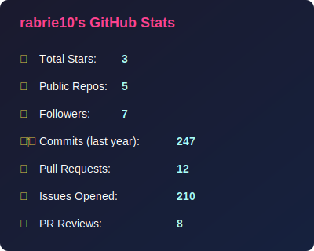
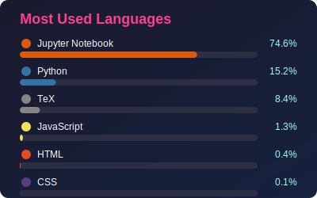

<!-- 🌟 Animated Greeting -->
<h1 align="center">Hi there 👋</h1>

<!-- Animated Divider -->

  

<strong>🛠️ Tools I've Used</strong>

<!-- Icons -->

  <!-- Languages -->
  
  
  
  
  
  

  <!-- ML -->
  
  
  
  

  <!-- Web / Backend -->
  
  

  <!-- Tools -->
  
  
  
  
  

<!-- Optional: GitHub stats from local files (remove if you don't generate them) -->
<!--

  
  

-->

<!-- Live streak -->

  

<!-- Typing SVG -->

  

<!-- Links -->

  <a href="https://www.linkedin.com/in/robel-ghebremedhin-57669ed" target="_blank">LinkedIn</a>
  &nbsp;•&nbsp;
  <a href="mailto:weld@gmail.com">Email</a>
  &nbsp;•&nbsp;
  <a href="https://github.com/rabrie10" target="_blank">GitHub</a>

